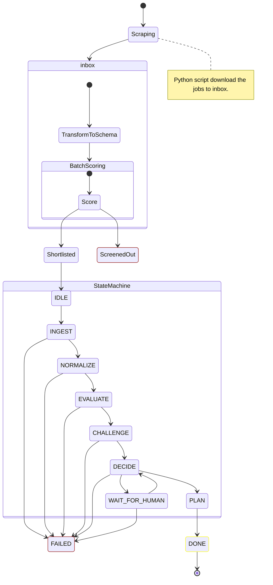

# apply-agent ~~👷💭~~ <sup>noname</sup>[^1]_+_<sub>**wip**</sub>

Self-hosted job scraper runner, with self-hosted LLM-powered CV matching.

> [!CAUTION]
> 🍪 It’s possible to filter out legitimate jobs, so use it with caution.

# User Configuration

There are three config files the user can configure. Running `./scripts/install.sh` in the project root creates basic placeholder versions, but they require some tuning to produce reliable results.

## ⛓️ .env.local

The original [`.env`](../.env) file with the project’s environment variables is part of the repository and contains sensible defaults for LLM APIs and local paths. To override any value, create a `.env.local` file with your local configuration.

### Models

Running LLMs on CPU won’t provide optimal performance. If you have access to a properly configured Ollama server, set the `OLLAMA_BASE_URL=http://_/"-._/"-._:11434` environment variable accordingly.

Otherwise, you can adjust the models by choosing a lighter `BATCH_MODEL` and a stronger `AGENT_MODEL`.

| Model            | Size   | Notes                                    |
| ---------------- | ------ | ---------------------------------------- |
| SmolLM2 1.7B     | ~1.7 B | Compact, efficient general LLM           |
| Qwen3-1.7B       | ~1.7 B | Similar balance of performance/size      |
| TinyLlama 1.1B   | ~1.1 B | Slightly smaller, faster                 |
| Llama3.2 1B      | ~1 B   | Meta model with good instruction ability |
| Gemma3 1B        | ~1 B   | Lightweight, strong CPU performance      |
| DeepSeek-R1 1.5B | ~1.5 B | Another mid-size small model             |


## ⛓️ config.yaml

Job search parameters live under the **`jobspy` root node**.

This object is passed to the scraper function. The exact location of the configuration is defined by the `CONFIG_FILE` environment variable.

See the full [parameter list](https://github.com/speedyapply/JobSpy?tab=readme-ov-file#parameters-for-scrape_jobs) to find the right (**working**) settings.

Example:

```yaml
jobspy:
  site_name:
    - linkedin
    # - zip_recruiter
    - indeed
    # - glassdoor
    # - google
    # - bayt
    # - bdjobs
  search_term: software engineer
  location: London
  country_indeed: UK
  results_wanted: 10
  # hours_old: 72
  verbose: 0
```

## ⛓️ cv.md

The CV location is defined by the `CV_FILE` environment variable. The file should be in _Markdown_ format. The better the CV, the better the job matches.

# Mode semantics

The agent runs in strict mode by default. To skip questions, set the mode to _exploratory_.

| Strict                                       | Exploratory                               |
| -------------------------------------------- | ----------------------------------------- |
| Any unresolved uncertainty → WAIT_FOR_HUMAN  | Hard gaps → ask once, then proceed        |
| Hard gaps → WAIT_FOR_HUMAN                   | Low confidence → assume best-case         |
| Low confidence → WAIT_FOR_HUMAN              | LOW_QUALITY → downgrade severity, proceed |
| LOW_QUALITY from EVALUATE/CHALLENGE → FAILED | Bias toward PLAN                          |

## Data flow

```
[ Python scraper ]
        ↓
  (job records)
        ↓
[ job inbox (files) ]
        ↓
[ batch scorer ]
        ↓
[ ranked jobs ]
        ↓
[ agent runs ]
```

## Run step by step

1. Clear job folders

    ```bash
    rm -rv ./data/jobs/*
    ```

2. Setup project

    ```bash
    ./scripts/install.sh
    ```

    - Install Python requirements venv

      ```bash
      ./scripts/install_tools.sh
      ```

3. Scrape jobs

    - Enable virtual environment locally

      ```bash
      source tools/scraper/venv/bin/activate
      ```

    ```bash
    python tools/scraper/runner.py
    ```

4. Pre-process scraped jobs

    ```bash
    bun cli ingest
    ```

5. Batch scoring jobs

    ```bash
    bun cli scoring
    ```

6. Evaluate jobs

    ```bash
    bun cli evaluation
    ```

7. Answer questions

    ```bash
    bun cli answer
    ```

    After answering, don’t forget to re-evaluate jobs.

## Install

### Bun

[Follow](https://bun.com/get) the instructions. 🤓

### Python

Use a stable Python version (3.11, 3.12, or 3.13) due to NumPy compatibility.

```bash
python3.12 -m venv tools/scraper/venv
source tools/scraper/venv/bin/activate
pip install -r tools/scraper/requirements.txt
```

## Run

### A single process

```bash
$ bun cli
Run a single step.

USAGE
  bun cli <ingest|scoring|evaluation|answer> [job-id]
```

### The orchestrator

Runs indefinitely, except for the answers step.

```bash
bun start
```

### Verbose

Monitor jobs folder to see the jobs actualy state.

```bash
bun lt
```

## Jobs folder structure

Every job is a _JSON_ file. During the evaluation process, it gets updated with notes and travels between status folders. No database required.

Here is the folder sctructure for `./[job-id].json` files for further process structure:

```
data/jobs
     ├── inbox              # raw scraped jobs (unscored)
     ├── screened_out       # rejected by batch scoring
     ├── shortlisted        # passed batch scoring
     ├── awaiting_input     # agent needs human input
     ├── declined           # rejected by agent reasoning
     └── approved           # agent-approved jobs
```

## States



<!-- ## What’s automated

There are three main automated processes. They can run in parallel.

| 1. Get Jobs                      | 2. Filter Out the Noise              | 3. Evaluate                       |
| -------------------------------- | ------------------------------------ | --------------------------------- |
| ☑️ Visit job site(s)              | ☑️ Normalise scraped jobs             | ☑️ Challenge shortlisted jobs      |
| ☑️ Search by pre-defined criteria | ☑️ Run batch scoring and find signals | ☑️ Put them into the state machine |
| ☑️ Download results               | ☑️ Screen out irrelevant jobs         | 🔘 Enjoy approved jobs             |

If something is ambiguous during the job categorisation process, the user (HITL) will need to answer a few questions to clarify it.

### How’s it going?

Batch reject:\
_“**Not worth thinking about.**”_

Agent reject:\
_“**Thought about it carefully and decided no.**”_ -->

## How to run?

The simplest way to run the project is with [Docker Compose](https://docs.docker.com/compose/install#docker-desktop-recommended). It automatically sets up [local LLM models](./docs//config.md#models) (CPU-only for now) and starts searching for jobs right away. You’ll need about 3 GB of disk space with the default settings. Clone the repository and run with the default settings:

1. Clone the repository

2. Run Docker Compose

   ```bash
   docker compose up
   ```

[^1]: <ins>Apply</ins> in the repo name is confusing — it doesn’t actually do anything.
