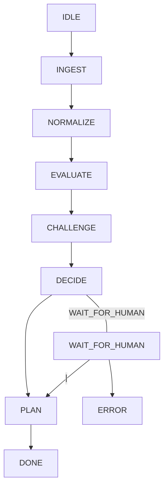

Notes.

## Etc.

## Folder structure

Every job is a _JSON_ file. During the evaluation process, it gets updated with notes and travels between status folders. No database required.

Here is the folder sctructure for `./[job-id].json` files for further process structure:

```
data/jobs/
     ├── inbox/             # raw scraped jobs (unscored)
     ├── screened_out/      # rejected by batch scoring
     ├── shortlisted/       # passed batch scoring
     ├── awaiting_input/    # agent needs human input
     ├── declined/          # rejected by agent reasoning
     └── approved/          # agent-approved jobs
```

### Data flow

```
[ Python scraper ]
        ↓
  (job records)
        ↓
[ job inbox (files) ]
        ↓
[ batch scorer ]
        ↓
[ ranked jobs ]
        ↓
[ agent runs ]
```

### Agent states

```
IDLE
  ↓
INGEST
  ↓
NORMALIZE
  ↓
EVALUATE
  ↓
CHALLENGE
  ↓
DECIDE <───> WAIT_FOR_HUMAN
  ↓               |
 PLAN             |
  ↓               ↓
 DONE            ERROR
```

autoconvert:



### Mode semantics

The agent runs in strict mode by default. Add the parameter __**x**__ — `bun start run x` — to start in exploratory mode (no questions).

| Strict                                       | Exploratory                               |
| -------------------------------------------- | ----------------------------------------- |
| Any unresolved uncertainty → WAIT_FOR_HUMAN  | Hard gaps → ask once, then proceed        |
| Hard gaps → WAIT_FOR_HUMAN                   | Low confidence → assume best-case         |
| Low confidence → WAIT_FOR_HUMAN              | LOW_QUALITY → downgrade severity, proceed |
| LOW_QUALITY from EVALUATE/CHALLENGE → FAILED | Bias toward PLAN                          |
