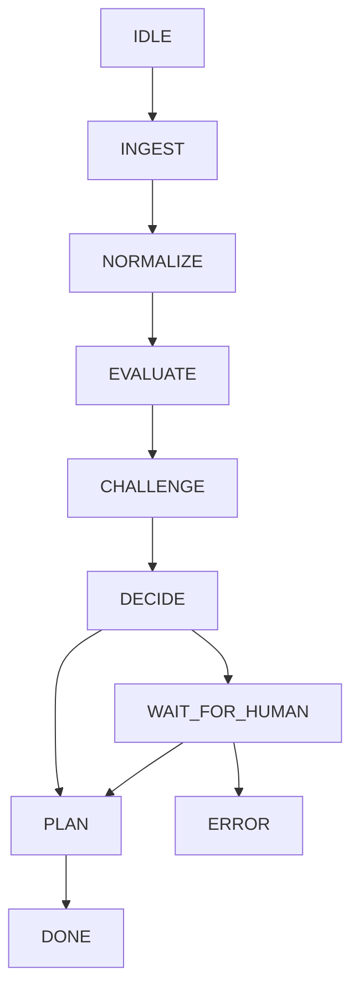

## States

gent runs the state machine – the final step in the data flow.

### Data flow

```
[ Python scraper ]
        ↓
  (job records)
        ↓
[ job inbox (files) ]
        ↓
[ batch scorer ]
        ↓
[ ranked jobs ]
        ↓
[ agent runs ]
```

### Agent states

```
IDLE
  ↓
INGEST
  ↓
NORMALIZE
  ↓
EVALUATE
  ↓
CHALLENGE
  ↓
DECIDE <───> WAIT_FOR_HUMAN
  ↓               |
 PLAN             |
  ↓               ↓
 DONE            ERROR
```

autoconvert:



### Mode semantics

The agent runs in strict mode by default. To skip questions, set the mode parameter: `bun start run --mode=exploratory`.

| Strict                                       | Exploratory                               |
| -------------------------------------------- | ----------------------------------------- |
| Any unresolved uncertainty → WAIT_FOR_HUMAN  | Hard gaps → ask once, then proceed        |
| Hard gaps → WAIT_FOR_HUMAN                   | Low confidence → assume best-case         |
| Low confidence → WAIT_FOR_HUMAN              | LOW_QUALITY → downgrade severity, proceed |
| LOW_QUALITY from EVALUATE/CHALLENGE → FAILED | Bias toward PLAN                          |
