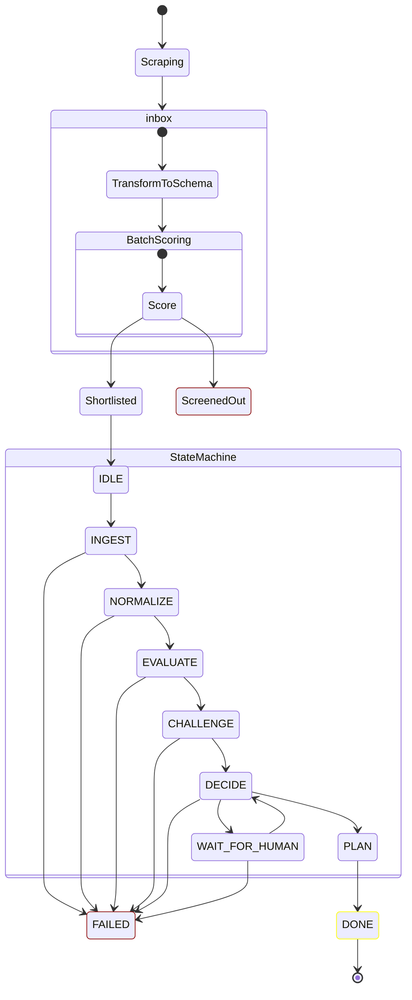

## States



## States (text)

```
IDLE
  ↓
INGEST
  ↓
NORMALIZE
  ↓
EVALUATE
  ↓
CHALLENGE
  ↓
DECIDE <───> WAIT_FOR_HUMAN
  ↓               |
 PLAN             |
  ↓               ↓
 DONE            ERROR
```
